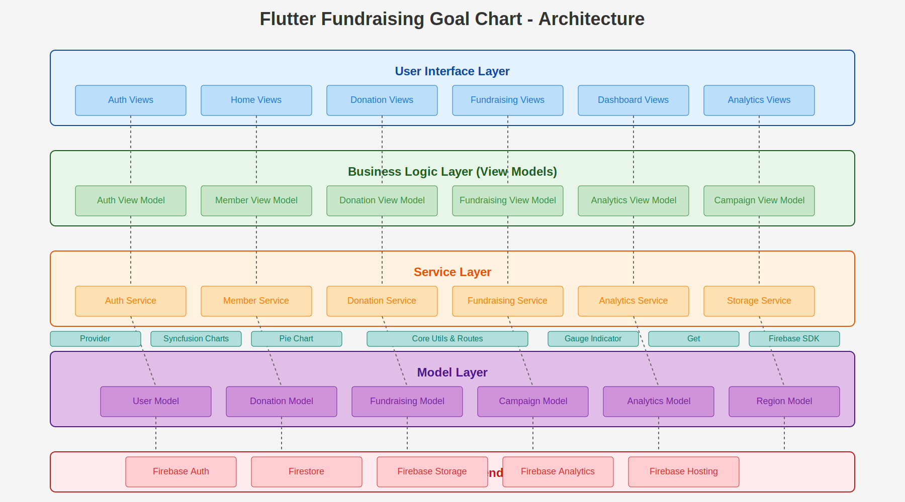

# Flutter Fundraising Goal Chart

## Overview

Flutter Fundraising Goal Chart is a comprehensive web application designed specifically for non-profit organizations to efficiently manage members and track donations. The application offers real-time donation monitoring with instant graphical representation, providing organizations with valuable insights through customizable dashboards. These dashboards can be filtered by regions, countries, donation types, amounts, and other relevant metrics.





## Features

- **Member Management**: Complete tracking and management of organization members
- **Donation Tracking**: Comprehensive system for recording and monitoring donations
- **Real-time Analytics**: Live updates of donation data with instant visualization
- **Interactive Dashboards**: Customizable views based on various parameters
- **Regional Insights**: Geographical breakdown of donation activities
- **Authentication System**: Secure user authentication and profile management
- **Fundraising Campaigns**: Create, manage, and track individual fundraising campaigns

## Technologies

### Core Technologies
- **Flutter 3.x**: Cross-platform UI toolkit for building the web application
- **Provider**: State management solution for Flutter applications
- **Firebase**: Backend services including authentication and database
- **Get**: Lightweight package for navigation and dependency injection

### Firebase Services
- **Firebase Authentication**: User authentication and management
- **Cloud Firestore**: NoSQL database for storing application data
- **Firebase Hosting**: Deployment and hosting of the web application

### Visualization Libraries
- **Syncfusion Flutter Charts**: Advanced charting for analytics
- **Pie Chart**: Visualization of donation distribution
- **Gauge Indicator**: Visual representation of fundraising goals progress

## Project Structure

```
lib/
├── core/
│   ├── routes/
│   └── utils/
├── models/
├── services/
├── view_models/
├── views/
│   ├── auth/
│   ├── donation/
│   ├── fundraising/
│   └── home/
└── main.dart
```

- **core**: Contains application-wide utilities and routing configuration
- **models**: Data models representing users, donations, and fundraising campaigns
- **services**: Service layer for Firebase and other external integrations
- **view_models**: Business logic and state management for views
- **views**: UI components and screens

## Installation

### Prerequisites

- Flutter SDK 3.6.0 or higher
- Dart SDK 3.0.0 or higher
- Firebase account
- Git

### Setup Instructions

1. Clone the repository:
   ```bash
   git clone https://github.com/your-organization/flutter_fundraising_goal_chart.git
   cd flutter_fundraising_goal_chart
   ```

2. Install dependencies:
   ```bash
   flutter pub get
   ```

3. Configure Firebase:
    - Create a new Firebase project in the [Firebase Console](https://console.firebase.google.com/)
    - Enable Authentication and Firestore services
    - Add a web app to your Firebase project
    - Download the Firebase configuration file
    - Update the `firebase_options.dart` file with your configuration

4. Run the project:
   ```bash
   flutter run -d chrome
   ```

## Firebase Configuration

### Authentication

The application uses Firebase Authentication with email/password method. To configure:

1. In the Firebase Console, navigate to Authentication
2. Enable Email/Password sign-in method
3. Set up any additional authentication rules as needed

### Firestore Database

The database structure follows this schema:

- **users**: Collection for user profiles
    - User ID (document)
        - name: String
        - email: String
        - role: String

- **donations**: Collection for donation records(not completed yet)
    - Donation ID (document)
        - amount: Number
        - donorId: String (reference to user)
        - date: Timestamp
        - type: String
        - region: String
        - country: String

- **fundraising**: Collection for fundraising campaigns
    - Campaign ID (document)
        - title: String
        - goal: Number
        - current: Number
        - startDate: Timestamp
        - endDate: Timestamp

### Security Rules

Implement appropriate Firestore security rules to protect your data:

```
rules_version = '2';
service cloud.firestore {
  match /databases/{database}/documents {
    match /users/{userId} {
      allow read: if request.auth != null;
      allow write: if request.auth != null && request.auth.uid == userId;
    }
    match /donations/{donationId} {
      allow read: if request.auth != null;
      allow write: if request.auth != null && request.resource.data.donorId == request.auth.uid;
    }
    match /fundraising/{campaignId} {
      allow read: if true;
      allow write: if request.auth != null && get(/databases/$(database)/documents/users/$(request.auth.uid)).data.role == 'admin';
    }
  }
}
```

## CI/CD Pipeline
Not competed yet!!!

### Continuous Integration

This project uses GitHub Actions for continuous integration with the following workflow:

1. Code linting and static analysis
2. Automated testing
3. Build verification

Example workflow configuration:

```yaml
name: Flutter CI

on:
  push:
    branches: [ main ]
  pull_request:
    branches: [ main ]

jobs:
  build:
    runs-on: ubuntu-latest
    steps:
      - uses: actions/checkout@v3
      - uses: subosito/flutter-action@v2
        with:
          flutter-version: '3.6.0'
          channel: 'stable'
      - run: flutter pub get
      - run: flutter analyze
      - run: flutter test
      - run: flutter build web
```

### Continuous Deployment

For continuous deployment to Firebase Hosting:

```yaml
name: Deploy to Firebase Hosting

on:
  push:
    branches: [ main ]

jobs:
  build_and_deploy:
    runs-on: ubuntu-latest
    steps:
      - uses: actions/checkout@v3
      - uses: subosito/flutter-action@v2
        with:
          flutter-version: '3.6.0'
          channel: 'stable'
      - run: flutter pub get
      - run: flutter build web
      - uses: FirebaseExtended/action-hosting-deploy@v0
        with:
          repoToken: '${{ secrets.GITHUB_TOKEN }}'
          firebaseServiceAccount: '${{ secrets.FIREBASE_SERVICE_ACCOUNT }}'
          channelId: live
          projectId: your-firebase-project-id
```

## Testing
Not Completed Yet !!!
### Unit Tests

Unit tests focus on individual components and services:

```bash
flutter test test/unit/
```

### Widget Tests

Widget tests verify UI components work as expected:

```bash
flutter test test/widget/
```

### Integration Tests

End-to-end testing of application workflows:

```bash
flutter test integration_test/
```

## Deployment

### Firebase Hosting

1. Install Firebase CLI:
   ```bash
   npm install -g firebase-tools
   ```

2. Login to Firebase:
   ```bash
   firebase login
   ```

3. Initialize Firebase Hosting:
   ```bash
   firebase init hosting
   ```

4. Build the web application:
   ```bash
   flutter build web
   ```

5. Deploy to Firebase:
   ```bash
   firebase deploy --only hosting
   ```

## Contributing

1. Fork the repository
2. Create a feature branch (`git checkout -b feature/amazing-feature`)
3. Commit your changes (`git commit -m 'Add some amazing feature'`)
4. Push to the branch (`git push origin feature/amazing-feature`)
5. Open a Pull Request

## License

This project is licensed under the MIT License - see the LICENSE file for details.

## References

- [Flutter Documentation](https://flutter.dev/docs)
- [Firebase Documentation](https://firebase.google.com/docs)
- [Provider Package](https://pub.dev/packages/provider)
- [GoRouter Documentation](https://pub.dev/packages/go_router)
- [Syncfusion Flutter Charts](https://pub.dev/packages/syncfusion_flutter_charts)
